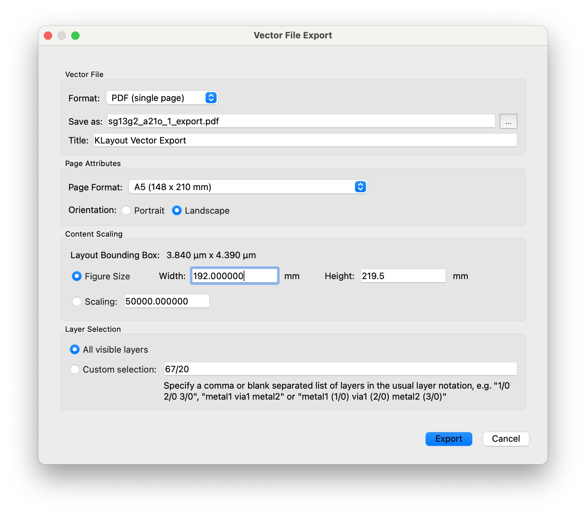

# KLayout Plugin: Vector File Export (PDF, SVG)

* Export your layout as PDF or SVG
   * precise scaling factor
   * choose which layers to include

This add-on can be installed through [KLayout](https://klayout.de) package manager, [see installation instructions here](#installation-instructions)

After installation, the export dialog can be accessed through *File*→*Export Vector File…*

## Installation using KLayout Package Manager

1. From the main menu, click *Tools*→*Manage Packages* to open the package manager
2. Locate the `VectorFileExportPlugin`, double-click it to select for installation, then click *Apply*
3. Review and close the package installation report
4. Confirm macro execution
